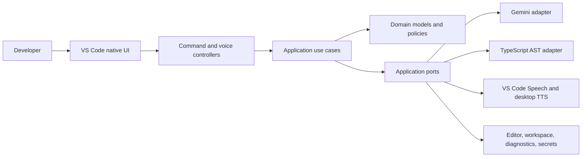
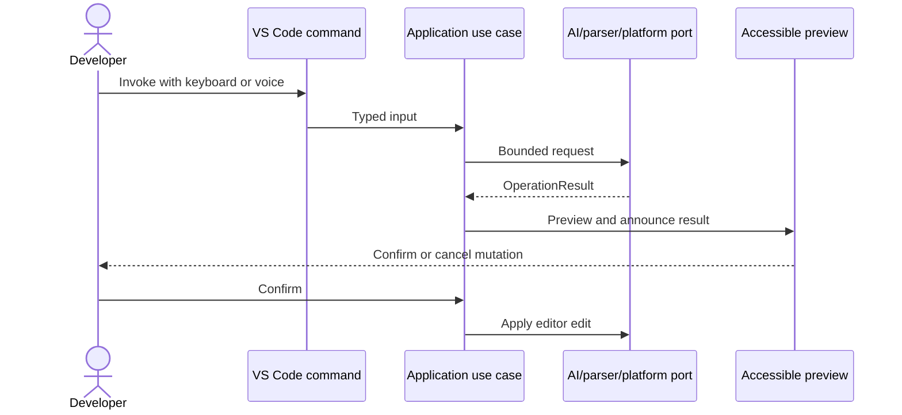

# CodeSpeak AI architecture

## Design goals

The architecture keeps accessibility policy and use cases independent from VS Code, Gemini, operating-system speech, and parser implementations. Dependencies point inward toward domain contracts.

## Layers

| Layer          | Responsibility                                                        | Examples                                                                 |
| -------------- | --------------------------------------------------------------------- | ------------------------------------------------------------------------ |
| Domain         | Stable models and accessibility rules without framework dependencies. | Profiles, voice intents, code structure, diagnostics.                    |
| Application    | Orchestrates use cases through ports.                                 | Generate code, explain diagnostics, read structure, navigate files.      |
| Infrastructure | Implements external technology boundaries.                            | Gemini REST, TypeScript AST, persistence, desktop speech.                |
| Presentation   | Owns VS Code-native interaction and accessibility announcements.      | Commands, QuickPick, status bar, Problems diagnostics, voice controller. |
| Bootstrap      | Composes concrete services and manages extension lifetime.            | Service container and extension activation.                              |

## Request flow

## Dependency injection

`createServiceContainer` is the composition root. Services receive interfaces in constructors; external adapters are not instantiated inside use cases. VS Code disposables are registered with `ExtensionContext.subscriptions`.

## AI boundary

The Gemini adapter:

- Reads the key from SecretStorage.
- Loads reusable prompts from `resources/prompts`.
- Validates structured responses before returning them.
- Bounds request context and applies timeout/retry policy.
- Maps provider errors into stable `OperationError` codes.

Use cases never depend on Gemini-specific request types.

## Parsing boundary

`ParserRegistry` selects a parser by language ID. The TypeScript adapter uses compiler AST nodes for JavaScript, JSX, TypeScript, and TSX. It never reconstructs code structure with regular expressions.

## Speech boundary

VS Code does not expose stable raw microphone capture to extensions. CodeSpeak therefore delegates local transcription to Microsoft VS Code Speech through documented dictation commands. Voice text is parsed into an allowlisted `VoiceIntent`; mutating intents require confirmation.

Desktop speech output is implemented behind `SpeechSynthesizer`, with Windows, macOS, and Linux command factories. Screen-reader announcements do not depend on speech output.

See [decisions/0001-native-speech-boundary.md](decisions/0001-native-speech-boundary.md).

## Accessibility invariants

- Every feature has a keyboard path.
- Voice is optional and has a text equivalent.
- Status changes are exposed through `accessibilityInformation` or native notifications.
- Mutating AI output is previewed and confirmed.
- Custom colors do not communicate application state.
- Webviews are avoided while native VS Code controls can express the workflow.

## Failure model

Expected failures return `OperationResult<T>` with a stable error code, user-safe message, retryability, and optional recovery actions. Command boundaries log technical details and show a concise accessible error.

## Extension lifecycle

Activation creates one service container and registers commands. Output channels, diagnostics, status items, configuration listeners, and voice controllers are disposed by VS Code through the extension context.
